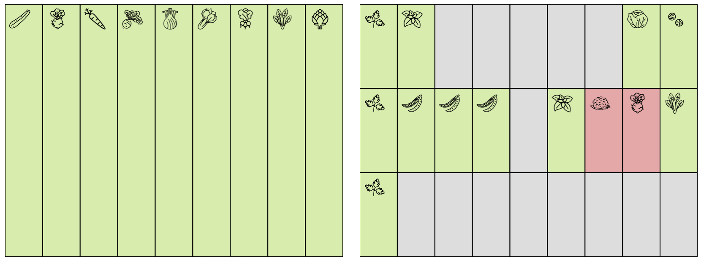

# garden-planner
plan your vegetable beds 



## note

This is a weekend project, it is in an early beta state, not much styling going on here. But it works :)

## install

```
npm install
```

## run

```
npm run start
```

Then open `localhost:3000/index.html`

## Storage

Everything is stored in config.json, feel free to also manually edit this file. App needs restarting before data is parsed again.

## Credits Icons

All Icons are taken from the noun project. Credits for the icons is held in ./app/images/credits.json

## references
http://www.hortipendium.de/Gem%C3%BCsearten_und_K%C3%BCchenkr%C3%A4uter
https://gartenglueck.info/fileadmin/user_upload/Einteilung_Pflanzenfamilien_2014.pdf
https://www.biogartenbedarf.de/mischkultur-im-biogarten/
https://garteln.info/uebersicht.php